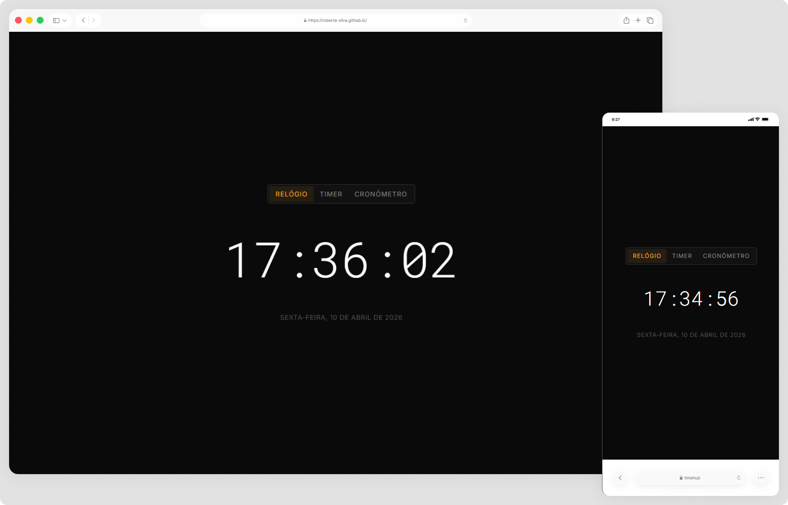

# Tempus ⏱️

Tempus é uma aplicação web em desenvolvimento que reúne diversas ferramentas relacionadas a tempo e datas em um único lugar. O projeto foi idealizado para praticar e consolidar conceitos de React, JavaScript e CSS, com foco em organização de código e construção de interfaces funcionais e intuitivas.

> Status do projeto: Em desenvolvimento ⌛

## Acesse o projeto

🔗 [https://roberta-silva.github.io/tempus/](https://roberta-silva.github.io/tempus/)

## Funcionalidades

- Exibição da hora atual
- Timer
- Cronômetro

## Objetivos técnicos

- Estruturação semântica do HTML5
- Criação de interfaces funcionais e intuitivas
- Manipulação do DOM com JavaScript
- Aplicação de lógica para cálculos de tempo e datas
- Evolução contínua do projeto com novas funcionalidades

## Tecnologias

- React
- JavaScript (ES6+)
- CSS3

## 👀 Preview

